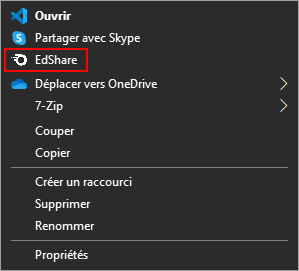
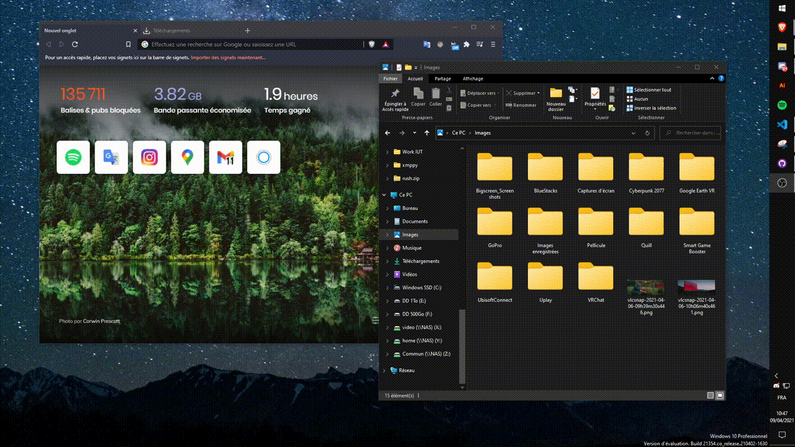

# EdShare
Share quickly file from Windows Right Click to web site using SSH

Requirements:
* Windows
* Python 3

Installation:
* Put the folder in the desired location for installation
* Open `install.bat` with right administrator
* Modify variables in `main.py`

Usage:
* Open Windows explorer
* Make a right click on file
* Select `EdShare` to upload file to your server

Note:
* If folder has moved, run `install.bat` after 

Uninstallation : 
* Open `uninstall.reg`

